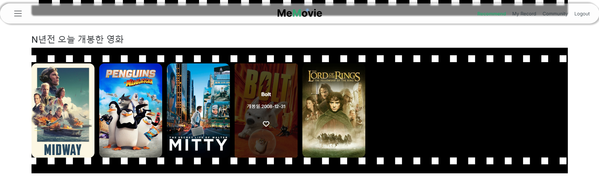

# MeMovie 🎥📆
## Introduce
메무비는 메모 + 영화를 합친말로, 영화를 사랑하고 자신만의 영화를 기록하고 싶은 사람들에게 영화 기록과 다양한 영화 추천 기능을 제공하는 웹 어플리케이션입니다.

> 나와 영화, me + movie
>
> 메모와 영화, memo + movie

메무비와 함께 당신의 영화를 기록해보아요.😎

## 팀원 소개
| 이름    | 역할    | 구현 기능                                    |
| ---------- | ---------- | ---------------------------------------------- |
| 손서현 | 팀장, 백엔드 | 영화 데이터 수집 및 초기 데이터 생성, 영화 추천 알고리즘 구현, fullcalendar 이용한 달력 기록 기능 구현, Rest API 설계, DB 테이블 생성 및 수정               |
| 강서연 | 프론트엔드 | 메인 페이지 및 영화 추천 페이지 포함한 페이지 디자인, 로그인 및 회원가입 구현, fullcalendar 달력 디자인, 기타 프론트엔드 구현                |

## 기술 스택

## 개발 기간
- 프로젝트 기간 2024년 11월 18일 ~ 11월 26일 (총 8일)

## 개발 일정

## 와이어 프레임

## ERD

## 주요 기능
### 1. 메인 페이지

### 2. 회원가입 및 로그인 페이지

### 3. 영화 추천 페이지
- 사용자가 좋아요를 해놓은 배우 기준으로 해당 배우의 출연작을 추천
- 영화 추천 페이지가 새로고침 될 때마다 좋아요 한 배우 중 랜덤으로 한 배우를 가져와 해당 배우 출연작을 평점이 높은 순으로 추천

- 사용자 기반 추천 외에도 N년전 오늘 개봉한 영화, 랜덤 추천 영화, 인기 영화, 날씨별 추천 영화도 제공하여, 사용자가 다양한 영화 추천을 받을 수 있도록 영화 추천 페이지 구성

### 4. 영화 상세 페이지
- 영화의 간략한 정보와 함께 감독과 출연 배우들을 사진과 함께 제공
- 배우 사진을 클릭하면 해당 배우의 간략한 소개와 이전 출연작들을 확인할 수 있으며, 하트 아이콘을 통해 사용자가 좋아하는 배우를 저장할 수 있는 기능 제공

### 5. 영화 기록 페이지
- 자신이 본 영화를 포스터와 함께 달력 형식으로 확인 가능

- 달력의 날짜를 선택하면 영화 기록창이 나와 영화 내용과 별점을 기록할 수 있는 폼 

- 영화 제목을 입력하면 자동완성 기능을 제공하고, 해당하는 영화 제목을 선택하면 오른쪽에 포스터가 자동으로 생성

### 6. 커뮤니티 페이지
- 자유롭게 영화와 관련된 이야기를 나눌 수 있는 커뮤니티 페이지 제공
- 나의 활동 탭을 통해 내가 작성한 게시글을 모아볼 수 있는 기능 제공

